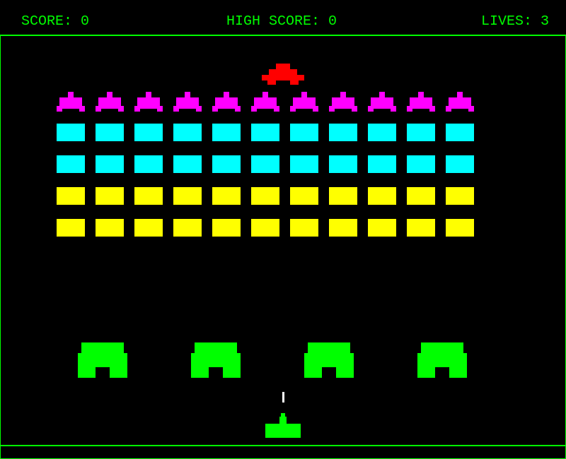

# Space Invaders

A classic Space Invaders arcade game clone built with HTML5 Canvas and vanilla JavaScript. Play directly in your browser with no dependencies required.

<p align="center">
  
</p>

> **Built entirely with [Claude Code](https://github.com/anthropics/claude-code) using a single one-shot prompt.**

## How to Play

Open `index.html` in any modern web browser to start the game.

### Controls

| Key | Action |
|-----|--------|
| `←` `→` | Move left/right |
| `Space` | Shoot |
| `P` | Pause/Resume |
| `Enter` | Start/Restart game |

## Features

- **Three enemy types** with different point values:
  - Squid (top row) - 30 points
  - Crab (middle rows) - 20 points
  - Octopus (bottom rows) - 10 points
- **Bonus UFO** - Appears periodically for 50-300 bonus points
- **Destructible shields** - Four barriers for cover that erode when hit
- **Progressive difficulty** - Enemies speed up as you destroy them
- **High score tracking** - Saved locally in your browser
- **3 lives** per game

## Running the Game

Simply open the HTML file:

```bash
# Using Python
python -m http.server 8000

# Using Node.js
npx serve .

# Or just open index.html directly in your browser
```

## License

MIT
